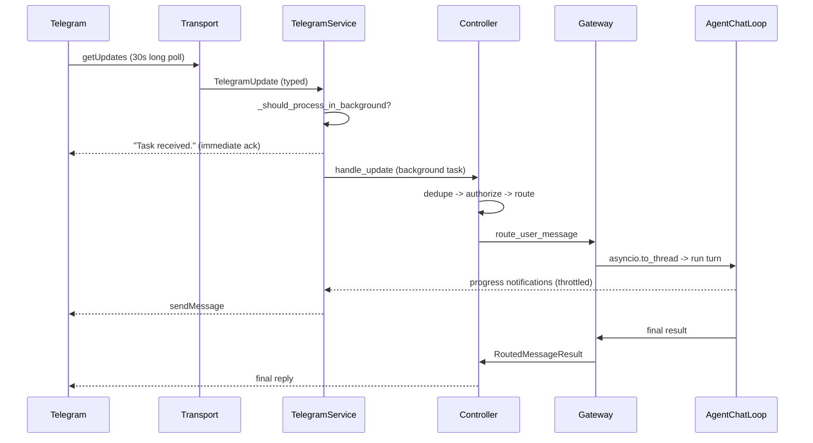

# Telegram Remote Control — Implementation Notes

How the Telegram bot is built, how a phone is authenticated and authorized to
drive SHAMSU, and how the bot and the local SHAMSU application run concurrently
— on the same project, and across different projects.

All code referenced lives in `shamsu/integrations/telegram/` (16 modules) unless
stated otherwise. Tests: `tests/test_telegram_remote_control.py` (30 tests).

---

## 1. How the Telegram bot is implemented

### 1.1 Design constraints

SHAMSU is a local-first agent: inference is local, there is no cloud API, and the
project deliberately carries no `[project.scripts]` entry point and a minimal
dependency set. The bot was built to respect that:

- **No Telegram library.** Not `python-telegram-bot`, not `aiogram`. The whole
  transport is raw HTTP against the Bot API through `httpx.AsyncClient`, which is
  already a top-level dependency (`pyproject.toml:11`). The integration adds
  **zero new dependencies**.
- **Long polling, not webhooks.** A webhook would require an inbound port, a
  public hostname and TLS — unacceptable for a tool that runs on a developer's
  laptop. `getUpdates` keeps the machine a pure outbound client, so it works
  behind NAT with no firewall changes.
- **No new process, no new protocol.** SHAMSU has no daemon, no IPC and no socket
  server (the only listening socket in the package is a transient OAuth callback
  in `mcp/auth.py`). The bot was therefore built to live *inside* an existing
  SHAMSU process, which turned out to be load-bearing for concurrency — see §3.

### 1.2 Module layout

| Module | Responsibility |
|---|---|
| `transport.py` | Bot API HTTP calls + raw-JSON → typed-object normalization |
| `service.py` | Lifecycle owner: poll loop, token loading, composition root |
| `controller.py` | Command / callback dispatch |
| `sessions.py` | Gateway into the SHAMSU agent runtime |
| `storage.py` | SQLite state: pairings, authorizations, callbacks, audit, metrics |
| `models.py` | Typed dataclasses and enums for every wire object |
| `keyboards.py` | Inline keyboard builders |
| `formatter.py` | Mobile-sized rendering + pagination |
| `local.py` | The REPL-side `/remote_control` command and thread manager |
| `approvals.py` | Approval broker bridging sync tool code to async chat |
| `pairing.py` | Pairing code issue / verify |
| `callbacks.py` | Opaque callback-token registry |
| `authentication.py` | Per-update authorization checks |
| `files.py` | Attachment staging |
| `commands.py` | Command parsing |
| `notifications.py` | Notification filtering |

### 1.3 The transport layer

`TelegramTransport` is an ABC with exactly two methods, `updates()` and `send()`
(`transport.py:23-33`). This abstraction is the project's main testability seam:
`TelegramBotApiTransport` talks to Telegram, and `FakeTelegramTransport`
(`transport.py:123`) is a pair of in-memory queues that the entire test suite
drives. No test touches the network.

Polling is a single async generator:

```python
async def updates(self) -> AsyncIterator[TelegramUpdate]:
    while not self._closed:
        offset = int(self._offset_getter() or 0)
        payload = await self._api("getUpdates", {
            "timeout": self._timeout_seconds,          # 30s long poll
            "offset": offset,
            "allowed_updates": ["message", "callback_query"],
        })
        for raw in payload:
            update = normalize_update(raw)
            self._offset_setter(update.update_id + 1)
            yield update
```

Two details matter:

- **The offset is persisted**, not held in memory. `_offset_getter` /
  `_offset_setter` are injected by the service and read/write the SQLite `meta`
  table (`service.py:317-325`), so a restart resumes the update stream instead of
  replaying it.
- **Raw JSON never leaves the transport.** `normalize_update` (`transport.py:142`)
  converts Telegram's untyped payloads into frozen dataclasses — `TelegramUpdate`,
  `TelegramMessage`, `TelegramUser`, `TelegramChat`, `TelegramFile`. Every layer
  above the transport works against types, so a Telegram API change is contained
  to one function.

Network errors are swallowed with a 2s backoff rather than killing the loop
(`transport.py:66-68`); a dropped Wi-Fi connection must not take the bot down.

### 1.4 Composition root

`TelegramService.__init__` (`service.py:35-89`) wires the whole object graph, and
every collaborator is an optional constructor argument that defaults to the real
implementation:

```python
def __init__(self, workspace, *, transport=None, token=None, store=None,
             gateway=None, installation_id=None, cli_mirror=None) -> None:
```

That is what lets tests substitute a fake transport, a fake gateway and a
temp-directory store while exercising the real controller, real pairing, real
authorization and real callback validation.

### 1.5 Decoupling the UI from the agent

`sessions.py` defines a `SessionGateway` **Protocol** (`sessions.py:44-87`) —
`list_sessions`, `switch_session`, `create_session`, `status`, `plan`, `changes`,
`tests`, `logs`, `route_user_message`, `cancel/pause/resume_current_run`. The
controller only knows this protocol.

`LocalShamsuSessionGateway` is the real implementation and is the only place that
knows about SHAMSU internals. It builds its own `SessionManager` and
`RuntimeStateStore` and translates each UI intent into existing runtime calls —
`SessionManager.resume_session`, `start_run`, `AgentToolRegistry`,
`AgentChatLoop`, `action_store`, `run_control`. **No agent code was modified to
support Telegram**; the integration is strictly additive.

### 1.6 Message lifecycle, end to end



1. `process_update` (`service.py:162`) classifies the update. Only authorized,
   non-empty, non-command, non-pairing-code, non-document **text** is treated as
   agent work (`_should_process_in_background`, `:196`).
2. Agent work gets an **immediate acknowledgement** and is then handed to an
   `asyncio.Task`. Everything else — commands, button presses, documents — is
   handled inline because it is fast.
3. `TelegramController.handle_update` (`controller.py:49`) dedupes on `update_id`,
   authorizes, then dispatches to a command, a callback, a file, or free text.
4. `route_user_message` (`sessions.py:201`) either merges into a live run or
   starts a new one (§3.3).
5. Replies are rendered by `TelegramFormatter` — short, plain-text, mobile-sized
   cards with pagination — and sent through `transport.send`.

### 1.7 Progress streaming

A long agent turn is silent by default, which reads as a hang on a phone.
`TelegramProgressReporter` (`sessions.py:342`) subclasses SHAMSU's existing
`ProgressReporter` and overrides `_emit`, so it hooks the progress stream the
agent already produces rather than inventing a parallel one. It throttles
(`sessions.py:366-376`): routine step updates are rate-limited to one per 8
seconds, while tool starts, shell commands, warnings, failures and completion
always go out immediately.

### 1.8 Configuration and the local command

The bot is driven from the REPL by `/remote_control`
(`local.py:96`), with subcommands `status`, `connect`, `configure <token>`,
`disconnect` and `repair`. The token is resolved by precedence
(`service.py:328`):

1. `SHAMSU_TELEGRAM_BOT_TOKEN`
2. `~/.shamsu/telegram.env` — **install-wide, and where `configure` writes.**
3. `<workspace>/.shamsu/telegram.env` — still read, so pre-P2 setups keep working
4. `<workspace>/.env`

`/remote_control configure <token>` binds the token to the installation, so
switching project no longer means configuring it again. `--workspace` pins it to
one project instead. A pre-P2 workspace token is promoted to the install once, on
the first `/remote_control` after upgrade; the old file is left in place.

`configure_telegram_bot_token` validates the token's shape before writing it
(`:373` — numeric id, `:`, ≥20 chars, no whitespace), and both target paths are
gitignored.

### 1.9 The CLI mirror

Remote control that is invisible locally is a security problem. Every inbound
Telegram message and every outbound reply is mirrored into a Rich panel in the
local terminal (`local.py:15-24`, `service.py:283-312`), so whoever is at the
machine sees exactly what the phone is doing. The mirror is filtered through the
same redaction used on the wire, and pairing codes are masked to
`"entered a pairing code."` rather than echoed (`service.py:380`).

---

## 2. How authentication and authorization are implemented

### 2.1 Threat model

A Telegram bot token is a bearer credential and a bot's `@name` is discoverable —
**anyone on Telegram can send messages to the bot**. Telegram itself provides no
notion of "this user owns this laptop". So the design question is: how does a
chat prove it belongs to the person sitting at the machine?

The answer taken here: **authentication is proof of local access.** The
credential that grants control is minted in the local terminal and must be typed
back into the chat within a short window.

### 2.2 Pairing — establishing identity

Running `/remote_control` locally calls `PairingManager.create_code`
(`pairing.py:42`):

```python
def create_code(self) -> PairingCode:
    code = f"{secrets.randbelow(1_000_000):06d}"
    ...
    self.store.create_pairing_code(
        pairing_id=pairing.pairing_id,
        code_hash=self._hash_code(code),        # SHA-256 — the code itself is never stored
        installation_id=self.installation_id,
        expires_at=pairing.expires_at,          # now + 300s
    )
```

Properties, each deliberate:

- **CSPRNG**, not `random` — `secrets.randbelow`.
- **Only the SHA-256 hash is persisted** (`pairing.py:92`). Someone who reads the
  state database cannot recover a usable code.
- **300-second TTL.**
- **Displayed only in the local terminal**, never sent over any network.
- Bound to an **`installation_id`** — a per-install `shamsu-<hex16>` generated
  once and stored in `meta` (`service.py:252`), so a code minted by one
  installation cannot authorize another.

`PairingManager.verify` (`pairing.py:57`) then enforces, in order:

| Check | Line | Rejects |
|---|---|---|
| Private chat only | 65 | Pairing from a group or channel |
| Hash lookup | 67 | An invalid code |
| Attempt counter, max 5 | 70-72 | Brute-forcing a 6-digit code |
| `consumed_at` empty | 73 | Replay of an already-used code |
| Not expired | 79 | A stale code |

On success the code is consumed and the user is written to `authorized_users`.

**The identity stored is the numeric `telegram_user_id` plus `telegram_chat_id`,
never the `@username`** — usernames are user-changeable and reassignable, numeric
ids are not. There is a regression test pinning this (`test_telegram_remote_control.py:200`).

### 2.3 Authorization — checked on every single update

Authentication happens once; **authorization happens on every update**
(`authentication.py:22`):

```python
def authorize(self, user: TelegramUser, chat: TelegramChat) -> AuthorizationResult:
    if not chat.is_private and not self.allow_group_chats:
        self.store.increment_metric("telegram_auth_failures")
        return AuthorizationResult(False, "Group and channel control is disabled.")
    record = self.store.authorization_for(user.user_id)
    if record is None:
        ...  return AuthorizationResult(False, "This Telegram user is not paired with SHAMSU.")
    if int(record["telegram_chat_id"]) != int(chat.chat_id):
        ...  return AuthorizationResult(False, "This chat is not authorized for the paired user.")
    return AuthorizationResult(True, permission_level=PermissionLevel(str(record["permission_level"])))
```

Three independent conditions: the chat must be private, the user must hold an
active authorization row, **and** the message must arrive in the same chat the
pairing was bound to. The third check means that even a paired user cannot drive
SHAMSU from a different chat context. Every failure increments an auditable
metric.

Group and channel chats are disabled by default (`allow_group_chats=False`) —
a group is a multi-party context where authorization cannot be attributed to one
person.

Revocation is `/remote_control disconnect`, which flips every authorization row
to `status='disconnected'` (`service.py:96-100`).

### 2.4 Authorizing button presses

Inline buttons are a second attack surface: Telegram callback data is
client-supplied and can be replayed. The design therefore puts **no semantic
meaning in callback data at all**. `CallbackRegistry.create` (`callbacks.py:21`)
mints an opaque token:

```python
action_id = f"tgcb_{secrets.token_urlsafe(18)}"
```

The real action, owning user, owning chat, session, run and approval id are
stored server-side. `validate` (`callbacks.py:50`) then enforces five conditions
before the press is honoured:

1. The token exists.
2. `telegram_user_id` matches the presser — one user cannot press another's button.
3. `telegram_chat_id` matches — the button cannot be forwarded to another chat.
4. If an `expected_run_id` is supplied, the token belongs to that run — a stale
   "Cancel" from a previous run cannot cancel the current one.
5. It is unconsumed and unexpired (600s), and consumption is atomic
   (`consume_callback_action` returns `False` if it lost the race), which makes
   every button strictly single-use.

### 2.5 Authorizing dangerous actions

Remote control must not weaken the local safety model. The approval broker's
docstring states the contract (`approvals.py:18-24`):

> SHAMSU's tool layer calls a synchronous approval function today. The broker
> keeps that contract while making the decision externally resolvable by the
> authorized Telegram user. **Normal local approval policy still decides what
> needs approval; Telegram only supplies the user's answer.**

So Telegram does not gain the ability to bypass approvals — it becomes a remote
answering device for approval questions the existing policy already raises. If
no broker is present, the gateway passes `lambda _request: False`
(`sessions.py:268`) — **fail closed**: with no way to ask, the answer is no.
A decision that never arrives times out after 900s and also returns `False`.

### 2.6 Secret handling

| Secret | Protection |
|---|---|
| Bot token | Never displayed. `/remote_control status` prints only its *source* (`service.py:279`). Redacted from session logs before writing (`local.py:141`) |
| Pairing code | Only SHA-256 stored; masked in the CLI mirror (`service.py:380`) |
| Callback tokens | Opaque, single-use, TTL-bound, owner-checked |
| Outbound message bodies | Every send passes through `safety.commands.redact` (`transport.py:82`) — the same redaction the rest of SHAMSU uses |
| Audit payloads | Scrubbed by `_redact_object` (`storage.py:451`) for `token` / `secret` / `password` / `api_key` keys |
| Staged file paths | Validated through `Sandbox` (`safety/sandbox.py`), which hard-rejects any path outside the workspace |

A dedicated test asserts the token never appears in any outbound message
(`test_telegram_remote_control.py:489`).

### 2.7 Audit trail

Every consequential action writes an `audits` row (`storage.py`) carrying
timestamp, source, `telegram_user_id`, `telegram_chat_id`, `telegram_message_id`,
`shamsu_session_id`, `run_id`, action, result and a redacted payload — including
`approval.requested` / `approval.resolved` pairs. Counters in `metrics` track
updates received, messages sent, send failures, auth failures and approvals.

### 2.8 Known gap

`PermissionLevel` (OWNER / OPERATOR / VIEWER) is defined, persisted and returned
by `authorize()` — **but the controller never reads it**. Pairing always grants
OWNER (`pairing.py:63`), so today every paired user has full control. The
enforcement point exists and is unused; wiring it is tracked work, not a
redesign.

---

## 3. Concurrency — bot and SHAMSU on the same project

### 3.1 Why the bot lives inside the SHAMSU process

This is the central architectural decision, and it follows from one fact:
**SHAMSU's run control is process-local.** `runtime/run_control.py:78` keeps

```python
_RUNS: dict[str, ControlledRun] = {}
```

and `ControlledRun` holds `asyncio.Event`, `asyncio.Queue` and `asyncio.Task`
objects. There is no IPC in SHAMSU, so an out-of-process bot could observe
sessions on disk but could never cancel, pause or steer a run the REPL was
executing.

The bot is therefore started as a **daemon thread with its own event loop inside
the REPL process** (`local.py:57-71`):

```python
self._loop = asyncio.new_event_loop()
self._thread = threading.Thread(target=self._run_loop, args=(self._loop, service),
                                name="shamsu-telegram-remote", daemon=True)
```

Sharing the process means sharing `_RUNS` — which is precisely what makes
`/status`, `/pause`, `/cancel` and mid-run feedback work against runs the local
REPL started, and vice versa.

### 3.2 Three execution contexts

| Context | Runs | Concurrency primitive |
|---|---|---|
| REPL main thread | The interactive prompt and locally-started turns | Blocking `prompt_toolkit` input |
| Bot poll thread | `getUpdates` loop, command/callback handling, sending | Its own `asyncio` event loop |
| Agent worker threads | Telegram-initiated agent turns | `asyncio.to_thread` → nested `asyncio.run` |

The critical property is that **the poll loop never blocks on agent work.**
`process_update` acks and offloads (`service.py:165-169`), and
`route_user_message` runs the turn via `asyncio.to_thread` (`sessions.py:216`).
A dedicated test proves `/status` is answered while a task is still running
(`test_telegram_remote_control.py:597`, driven by a `BlockingGateway`).

### 3.3 The key decision: merge, don't race

Two channels pointed at one session could easily start two competing runs on the
same files. They do not, because `route_user_message` checks for a live run
*first* (`sessions.py:207-215`):

```python
async def route_user_message(self, text, *, metadata) -> RoutedMessageResult:
    active = active_runs_for_session(metadata.session_id)
    if active:
        run = active[-1]
        accepted = add_feedback(run.run_id, text)      # steer the live run
        return RoutedMessageResult("Added your feedback to the active SHAMSU run." ...)
    return await asyncio.to_thread(self._run_agent_sync, text, metadata)
```

If SHAMSU is already working on that session — whether the run was started
locally or from the phone — the incoming message becomes **feedback injected into
the running turn**, not a second turn. There is one run with two input channels.
`add_feedback` (`run_control.py:219`) pushes onto the run's `feedback_queue`,
sets `feedback_event`, and cancels the in-flight model call so the new
instruction is picked up at the next iteration boundary rather than after the
current generation finishes.

The agent loop drains that queue at defined points (`chat_loop.py:1664`,
`tool_calling_loop.py:216`), so feedback lands between steps and never mid-write.

### 3.4 Crossing thread boundaries

Every boundary crossing uses an explicit, named mechanism:

| Crossing | Mechanism |
|---|---|
| Agent worker → poll loop (progress, approvals) | `loop.call_soon_threadsafe` (`service.py:243`) |
| Sync tool code → async chat (approval question) | `threading.Event` + `event.wait(900.0)` (`approvals.py:66,93`) |
| Poll loop → pending-approval map | `threading.Lock` around `self._pending` (`approvals.py:41`) |
| Any thread → persistent state | Fresh `sqlite3.connect(timeout=30)` per call with WAL (`storage.py:37-44`) |
| Bridge manager fields | `threading.Lock` (`local.py:34`) |

The SQLite choice matters: a per-call connection with WAL is safe from any
thread without a shared connection object, and it survives process restarts —
pairings and offsets are durable, proven by a restart-persistence test
(`test_telegram_remote_control.py:708`).

### 3.5 Idempotency

Telegram redelivers updates that were not acknowledged. `mark_update_processed`
(`storage.py:249`) inserts the `update_id` as a primary key and reports the
collision, so a redelivered update is dropped instead of running the task twice
(`controller.py:51`, test at `:252`).

### 3.6 Shared conversation state

The bot does **not** share in-memory session state with the REPL; continuity is
disk-mediated. `ChatState` hydrates from `messages.jsonl` at construction
(`agents/chat_state.py:233-247`, last 24 messages). Because both the REPL and the
bot read and append to the same session directory, each sees the other's turns —
without any shared object, and therefore without any object-lifetime coupling.

### 3.7 Timeouts tuned for a human in the loop

A remote run may sit waiting for a person to tap Approve. The task timeout is
therefore derived from the approval timeout rather than set independently
(`sessions.py:393-403`):

```python
return max(1800.0, approval_timeout + 300.0)     # override: SHAMSU_TELEGRAM_TASK_TIMEOUT_SECONDS
```

so a run can never be killed for a wait it was designed to perform.

### 3.8 Known defect

`ControlledRun`'s `asyncio` primitives are created inside the loop that runs the
turn, but `cancel_run` / `pause_run` / `resume_run` are invoked synchronously
from the **poll thread** (`sessions.py:218-228`). `asyncio.Event.set()` and
`Queue.put_nowait()` are not thread-safe across event loops, so a control request
issued from the poll thread may not reliably wake the waiter — `/pause` and
`/cancel` are not dependable in all cases. The fix is to drain control requests
on the loop that owns the run rather than calling into it from outside; it is a
known issue, not a design assumption.

---

## 4. Concurrency — bot and SHAMSU on different projects

### 4.1 The workspace is the isolation unit — for everything except the bot

Since P2 the split follows what each fact actually describes. The bot and the
phone belong to the **machine**; everything else belongs to the project:

| State | Location |
|---|---|
| Pairings, authorizations, callbacks, metrics, update offset | `~/.shamsu/telegram/telegram-state.db` — **install-wide** |
| Bot token | `~/.shamsu/telegram.env` (workspace files still read as fallback) |
| Installation id | `meta` row in the install database |
| Active session per user, audit trail | same database, scoped by a `workspace` column |
| Sessions and transcripts | `<workspace>/.shamsu/sessions/` |
| Run records | `<workspace>/.shamsu/runs/` |
| Runtime task state | `<workspace>/.shamsu/runtime-state.db` |
| File staging | `<workspace>/.shamsu/telegram/attachments/` |

The service resolves its workspace once and builds a `Sandbox` from it
(`files.py:27`, `service.py:349`). `Sandbox.validate` (`safety/sandbox.py:23-32`)
hard-rejects any path that does not resolve under the workspace root, and every
file operation the bot can reach passes through it.

**Consequence:** two SHAMSU installations in two projects are strongly isolated.
Neither can list, resume, read or write the other's sessions, files or runs, and
a pairing established in one project grants nothing in the other. That isolation
is enforced, not conventional.

### 4.2 What is supported today

**One active workspace at a time, per process.**
`LocalTelegramBridgeManager` is a module-level singleton (`local.py:93`) and
`service_for` *replaces* the service when the workspace changes:

```python
if self._service is None or self._workspace != resolved:
    self._service = TelegramService(resolved, cli_mirror=self._mirror)
    self._workspace = resolved
```

So a single REPL drives exactly one project from Telegram. Moving to another
project means running `/remote_control connect` from a REPL opened in that
project. Since P2 that no longer costs a re-pairing or a second `configure`: the
token and the pairing are install-wide, so the new service picks both up. What
changes is which workspace the runs happen in, which is the point.

Meanwhile the local REPL in the *first* project keeps working normally; it simply
no longer has a phone attached.

### 4.3 What is not supported, and precisely why

**Two workspaces cannot be driven from one bot simultaneously.** There are three
independent reasons, and the first is not fixable by configuration:

1. **Telegram delivers each update to exactly one long-poll consumer.** If two
   REPLs in two projects both connect using the same bot token, both call
   `getUpdates` against the same bot. Updates are then split
   non-deterministically between them, and each persists its own offset — so each
   process sees a partial, arbitrary slice of the conversation. Messages appear
   to vanish.
2. **The bridge manager holds one service.** Even within a single process, the
   singleton above replaces rather than accumulates.
3. **Pairing state is per-workspace**, so identity does not carry across
   projects.

A workable but clumsy present-day workaround is one bot token per project, which
means a separate bot and a separate chat for each — acceptable for two projects,
not for ten.

### 4.4 The designed path forward

Making one bot drive every project concurrently requires moving the bot out of
the REPL and up to the host, and the shape is already determined by the analysis
above:

- **A single detached daemon** (`shamsu bot start|stop|status`) as the *only*
  `getUpdates` consumer on the machine, which resolves reason 1 by construction.
  It must call `runtime/session_registry.py:register_session()`, or the last
  exiting REPL will stop Ollama underneath it (`runtime/ollama.py:209-233`).
- ~~**Host-level link state**~~ — **done in P2.** The token lives at
  `~/.shamsu/telegram.env` and the pairings at
  `~/.shamsu/telegram/telegram-state.db`, so pairing happens once per machine
  rather than once per project.
- **A workspace registry**, which does not exist anywhere in SHAMSU today
  (`~/.shamsu` is explicitly launcher-only, and everything else is cwd-relative).
  Without it there is no way to enumerate projects to list sessions across.
- **A multi-workspace gateway** holding one `LocalShamsuSessionGateway` per
  workspace — the existing gateway is already the right per-workspace unit and
  needs no change.
- **Session leases**, so exactly one process writes a session at a time. This is
  required for correctness, not just tidiness: `session.json` writes are
  non-atomic and unlocked (`session/manager.py:292-299`), `events.jsonl` and
  `messages.jsonl` appends are unlocked (`:424`, `:522`), and `state.json` is a
  lost-update read-modify-write (`:560`). Only `index.json` is `filelock`-guarded.
  With a lease, a message aimed at a session another process owns is handed to
  that owner instead of executed locally — which also generalises the
  merge-don't-race rule of §3.3 across process boundaries.
- **Host-wide model admission control.** Nothing in SHAMSU throttles inference:
  `llm/manager.py` opens a fresh `AsyncClient` per call (`:288`, `:495`) with no
  semaphore anywhere. With two projects active, the second request blocks in the
  socket, trips the 180-second idle window, and is reported as `LLMStalledError`
  — queueing misreported as a deadlock. A single host-wide model slot fixes the
  contention, and the connect/idle/total clocks must start only *after* the slot
  is granted so that waiting in the queue is untimed and unbounded.

---

## 5. Testing

`tests/test_telegram_remote_control.py` — 30 tests, all driven through
`FakeTelegramTransport`, `FakeGateway` and `BlockingGateway`. No network, no real
Telegram account, no live model.

Coverage by concern:

- **Authentication** — pairing on a stable numeric id (`:200`), expired and reused
  codes (`:211`), group-chat rejection (`:222`), unauthorized user (`:231`).
- **Authorization** — opaque callback switching (`:266`), wrong-user / wrong-run /
  duplicate callbacks (`:285`), expired callback (`:723`), approval callback and
  duplicate resolution (`:308`).
- **Secrets** — token never leaked in output (`:489`), token file/env precedence
  (`:500`, `:521`), `configure` writes and redacts (`:534`, `:546`), invalid token
  rejected (`:556`), pairing code masked in the CLI mirror (`:680`).
- **Concurrency** — `/status` answered while a task runs (`:597`), duplicate
  update suppressed (`:252`), pause/resume/cancel against real `run_control`
  (`:342`), ledger closed without a false failure (`:358`), progress notifications
  (`:401`), state surviving restart (`:708`).

---

## 6. Known limitations

| # | Limitation | Reference |
|---|---|---|
| 1 | Bot dies when the REPL exits — it is a daemon thread, not a service | `local.py:65-71` |
| 2 | One workspace at a time; no cross-project session listing or switching | `local.py:41-46` |
| 3 | `/pause` and `/cancel` are unreliable — cross-event-loop `Event.set()` | `sessions.py:218-228` |
| 4 | File uploads stage 0 bytes; there is no `getFile` call, and the staged path is discarded | `files.py:43`, `controller.py:318` |
| 5 | No throttling of concurrent model calls; queueing is reported as `LLMStalledError` | `llm/manager.py:288,495` |
| 6 | `PermissionLevel` is stored but never enforced — every paired user is an owner | `controller.py` |
| 7 | Replies over ~3900 characters are silently truncated to the first page | `controller.py:316` |
| 8 | `/switch` ignores its argument; it duplicates `/sessions` | `controller.py:113` |
| 9 | `/settings` is static text over a real settings store that is never called | `formatter.py:160` |
| 10 | No `parse_mode`, `answerCallbackQuery`, `setMyCommands` or `sendChatAction` | `transport.py` |
| 11 | Only `document` attachments are normalized — photos and voice are ignored | `transport.py:163` |
| 12 | Poll-loop status resets to `CONNECTED` after an error, so status can misreport | `service.py:230-231` |
